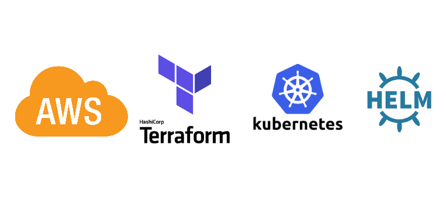

#Hashicorp Vault on Kubernetes (EKS) Aws

This repository will help you to deploy Hashicorp Vault on an EKS cluster. The benefits of using this solution, will be the automation and at same time, the user-friendly process. Infrastructure as code it's the easiest way create resource on cloud.
With some integration we can have multiple resources working together to solve a many number of problems.     



## How to ?

You will need some requirements to deploy and install Hashicorp Vault on EKS, follow the list:

1. Helm
2. Terraform 1.0.1
3. Kubectl
4. Aws Cli 2.0.61

Reference documentation and links:

https://helm.sh
https://www.hashicorp.com
https://kubernetes.io/docs/reference/kubectl/overview/
https://aws.amazon.com

## Installation

Inside the folder terraform you will have the structure based on environments. It should allow you to scale in one click to multiple environments and regions. (I'm always thinking on how to make it scalable)

```bash
.
├── README.md
├── env-dev
│   ├── eks_workers.tf
│   ├── keys_token.json
│   ├── main.auto.tfvars
│   ├── main.tf
│   ├── outputs.tf
│   ├── provider.tf
│   ├── script_dynamic_cred_aws_role.json
│   ├── script_dynamic_credential.sh
│   ├── script_emergency_unseal.sh
│   ├── script_setup_vault.sh
│   ├── terraform.tfstate
│   ├── terraform.tfstate.backup
│   ├── variables.tf -> ../variables.tf
│   └── vault_config.yml
├── modules
│   ├── eks.tf
│   ├── kms
│   │   ├── main.tf
│   │   ├── output.tf
│   │   └── variables.tf
│   ├── kms.tf
│   ├── kubernetes
│   │   ├── main.tf
│   │   ├── outputs.tf
│   │   ├── provider.tf
│   │   └── variables.tf
│   ├── network
│   │   ├── main.tf
│   │   ├── outputs.tf
│   │   ├── securitygroup.tf
│   │   ├── sg
│   │   │   ├── main.tf
│   │   │   ├── outputs.tf
│   │   │   └── variables.tf
│   │   └── variables.tf
│   ├── network.tf
│   ├── outputs.tf
│   └── variables.tf
└── variables.tf
```

Considering you already have all aws credentials in place, go to the next step, otherwise run to setup your credentials and follow all procedures:

```bash
aws configure
```

### Step 1 (AWS Resources)

Inside the folder env-dev, you should run:

```bash
terraform init && terraform apply
```

It should initialize your Terraform downloading all providers, modules and will run the plan asking your confirmation to apply, your answer should be: "yes", to create all resources.

When done with terraform apply, you should now have the EKS created and all required resources.

### Step 2 (Vault Configuration)

Inside the folder env-dev you will need to update the file `vault_config.yml`

Change the lines: 3 and 4 to match your HA setup. It will create a HA Vault Configuration

With an AWS access_key and access_secret with permissions to EKS, update the file as below. It will be used to auto unseal your Vault when needed.

Change the lines: 22 and 23 with the corresponding credentials. You could save the credentials inside your Kubernetes as a Secret, but that's not our case.
Change the line: 24 with the `kms_key_id` output from your Terraform Apply.  

### Step 3 (Deploying Vault)

With all configuration in place, now you will be able to proceed deploying the Hashicorp vault to Kubernetes Cluster

Run the script below to use Helm to deploy the configuration, init and unseal your Vault. When done, you will have the file `keys_token.json` with your recovery keys and root token. Keep it safe!

```bash
sh script_setup_vault.sh
```

It will be responsible to do all configuration in an automated and fashion way.

### Step 4 (Testing your Vault with Dynamic Secrets)

Now we will test your vault generating Dynamic secrets to allow us to test our vault and integration with AWS. Just run the script to enable Dynamic Credentials with AWS

Edit the script `script_dynamic_credential.sh` and set your AWS Credential. This credential should have all proper access to create new users and keys. (IAM)

```bash
sh script_dynamic_credential.sh
```

It should enable the engine, configure and output your first dynamic credential. Unfortunately it will be valid for 768hours. If needed, you can revoke it.

### Step 5 (Use case)

The Dynamic credential could be used with a lot of different scenarios, one example it's on CI/CD deployments. When creating infrastructure in the cloud, you could use Dynamic credentials to connect to the cloud, deploy the resource and then you can smoke the credentials, helping you to add one extra layer of security, where no one will know which credential has been used there.

Dynamic credentials are easy to implement and flexible to use. There's no need to allow users to have extra powers on your cloud, with the proper role and scope, your credential will be safe enough to solve all your needs.

### Step 6 (Manual Unseal)

If you're in need to unseal manually because you're not able to do the process with KMS due to a connectivity problem, you can clean up the config file commenting the lines related to `awskms` and run the script:

```bash
sh script_emergency_unseal.sh
```

It should enable your vault and put it back to work.